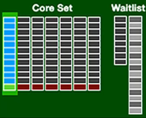
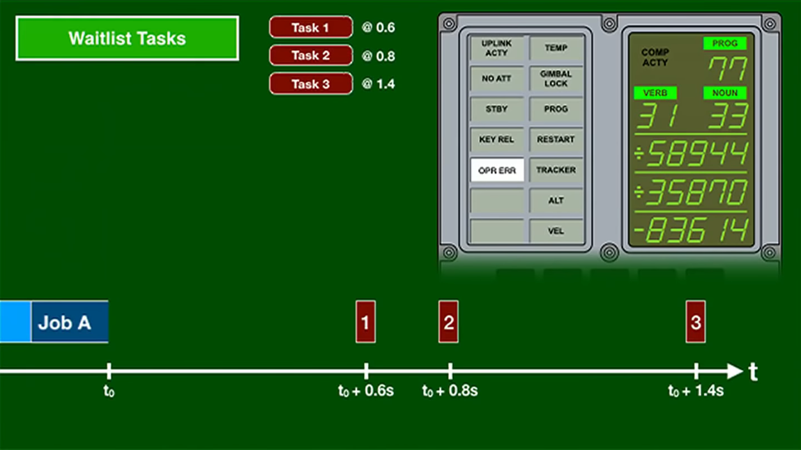
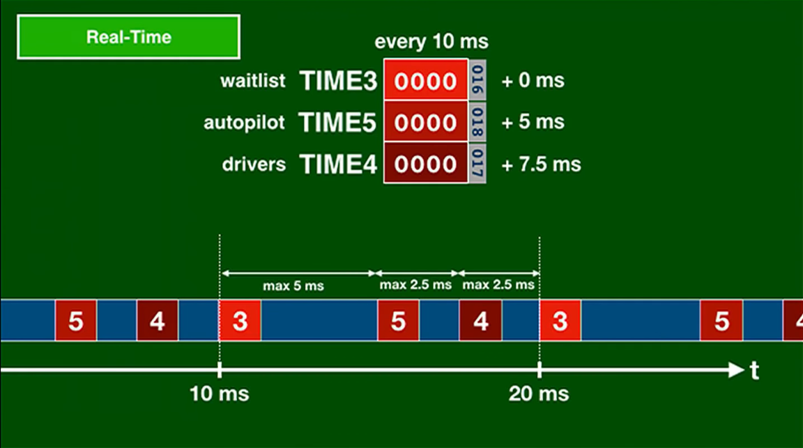

# Операционная система реального времени для микроконтроллеров AVR

Проект вдохновлен ОСРВ, использовавшейся на бортовом компьютере КА Апполон: Apollo Guidance Computer

## Executor

В основе ОС лежит концепт процессов (`job`), и задач (`task`).



## Процессы

**Процесс** - долгая задача, для выполнения которой требуется продолжительное время (от 15мс)

Описания процессов хранятся в структуре памяти, называемой `Core set` (корсет). В ней может хранится (пусть) 7 процессов (как в LM).
Структура вхождения в корсет:

```C++
typedef struct
{
    int8_t priority; // !< Приоритет данного процесса
    uint8_t PID; // !< Идентификатор процесса
    void (*worker)(Job_t* j); // !< Указатель на обработчик процесса
    uint8_t m[JOB_MEM]; // !< Локальная память процесса
} Job_t;
```

### Дополнительная память

В случае необходимости 

## Задачи

**Задача** - короткая задача, которая может быть выполнена без существенной задержки остальной системы. Например:

- изменить состояние пина GPIO
- разбудить процесс

Для планирования задач используется структрура `Waitlist` (лист ожидания).
Структура вхождения в лист ожидания:

```C++
typedef struct
{
    uint32_t wakeup_time; // !< Время запуска задачи (для отложенного запуска)
    void (*worker)(Task_t* t); // !< Указатель на обработчик задачи
} Task_t;
```

### Пример использования

Если `Job A` хочет дважды поморгать индикатором он может сделать следуюее:

1. Мгновенно зажечь нужный индикатор
2. Запланировать три новых отложенных задачи с соответствующими временными смещениями:

- `Task 1` - выключить индикатор
- `Task 2` - включить индикатор
- `Task 3` - выключить индикатор



Таким образом за одно действие без дальнейшего вмешательства процесс может осуществить сложную комбинацию действий.

## Реальное время

Предварительный период квантования системы - 5мс (200Гц) (на иллюстрации он 10мс).
Раз в период квантования происходит:

1. Анализ листа ожидания и запуск всех отложенных задач с прошедшим временем
2. Основной цикл управления
3. Обращение к периферии

Эти события смещены друг относительно друга так, чтобы никогда не накладываться друг на друга.
Подразумевается, что каждое событие обрабатывается меньше 1мс.

```-
    10мс           15мс
:---|---.---.------|---.--:
    |   |   |
    |   |   `- Периферия (+2.5мс)
    |   `- Основной цикл управления (+1.25мс)
    `- Обновление листа ожидания (+0мс)
```



## Сохранение состояния при перезагрузке

https://github.com/ukmars/mazerunner-core/blob/722cef54d5df91db955748d04f20e0f029fdc152/mazerunner-core/config.h#L137
```C++
#define PERSISTENT __attribute__((section(".noinit")))
```